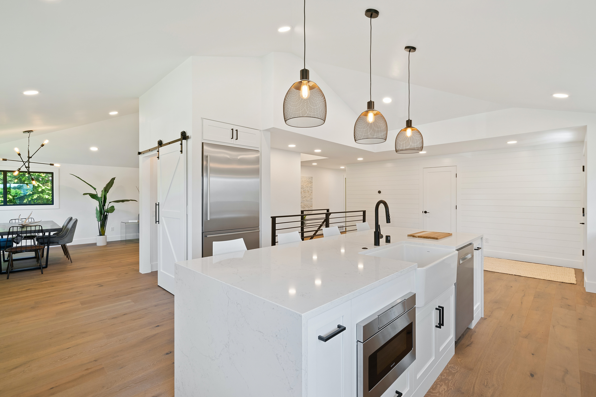

# Home Renovation Analysis 

* Author: Angela Loyola
* Student pace: Self-Paced
* Instructor name: Mark Barbour

## Overview and Business Problem

For this project, you will use multiple linear regression modeling to analyze house sales in a northwestern county.

### Business Problem

As a real estate company, many clients approach our firm seeking advice on how to increase the value of their existing homes through renovations before selling. This project aims to address this question and determine which types of home renovations can lift the estimated value of a property and providing our stakeholders with a quantifiable measure of that increase. 

### Data

Utilizing KC Housing Database, I will focus soley on variables that are feasible to renovate, such as bathrooms or heat source, while excluding data points like "Waterfront". By carefully selecting the variables to be tested, I will ensure that the resulting model generates actionable insights for our stakeholders.

## Methods & Results

By employing an iterative approach to construct a regression model, with price as the dependent variable, the final model will  identify the different influential factors that exhibit a strong correlation with home prices. 

Out of 6 model iterations, I selected the final model based on the statistical significance of both the model and the individual variables. Each variable in the model has a coefficient that is interpretable, and their low p-values indicate a high level of confidence in their statistical significance.

The F-statistic of 4558 and its very low p-value provide strong evidence that the model as a whole is statistically significant. This suggests that the included variables collectively have a strong relationship with the price.

These are the shortcomings of the previous models:

1. In Model 3, multiple heat source variables were found to be statistically insignificant. This implies that including these variables did not contribute significantly to explaining the price.

2. Model 4 attempted to address the issue by including only the statistically significant heat source variables. However, this resulted in the model's R-squared not improving from previous model iterations at all. 

3. In Model 5, the inclusion of sewer system variables came at the expense of the bathrooms variable, which seemed counterintuitive from a business standpoint. Additionally, the increase in the R-squared was only marginal.

Therefore, the final model was chosen over the previous iterations because it included only variables that were statistically significant (identified in iteration 1, 2 and 6) and contributed to the overall model's read on the variation of Price. Therefore, this model provides the most comprehensive view on the factors of a home the impact the overall value. 

## Recommendations and Conclusions 

Based on the regression results, here are four recommendations for homeowners looking to increase the value of their homes through renovations before selling:

1. <b> Focus on bathroom renovations: </b> Consider adding an additional bathroom or upgrading existing bathrooms to attract potential buyers and potentially increase the value of your home. However, it's important to carefully assess the cost-benefit ratio of such renovations to ensure they align with your budget and market expectations.

2. <b> Enhance the outdoor living space: </b>  Consider expanding or improving your outdoor living space to create an attractive and functional area for potential buyers. This could involve adding a patio, deck, or outdoor seating area, and landscaping to create a visually appealing environment.

3. <b> Invest in the living area: </b> If feasible, explore options for expanding the living space, such as adding an extension, converting a basement or attic into usable living space, or removing non-load-bearing walls to create an open floor plan. These enhancements can provide buyers with more living space and potentially increase the desirability and value of your home.

4. <b> Improve the condition of the property: </b> Prioritize making necessary repairs and upgrades throughout the property, including fixing any structural issues, updating outdated features, refreshing paint and finishes, and ensuring that the home is well-maintained. Creating a move-in ready and well-cared-for property can attract buyers and potentially increase the perceived value.

## Repository Structure 

'''
├── README.md                           <- The top-level README for reviewers of this project
├── index.ipynb   <- Jupyter Notebook file where analysis was conducted 
├── Home Renovation Analysis.pdf         <- PDF version of project presentation
├── data   <- Sourced Externally 
├── images <- Sources Externally
'''